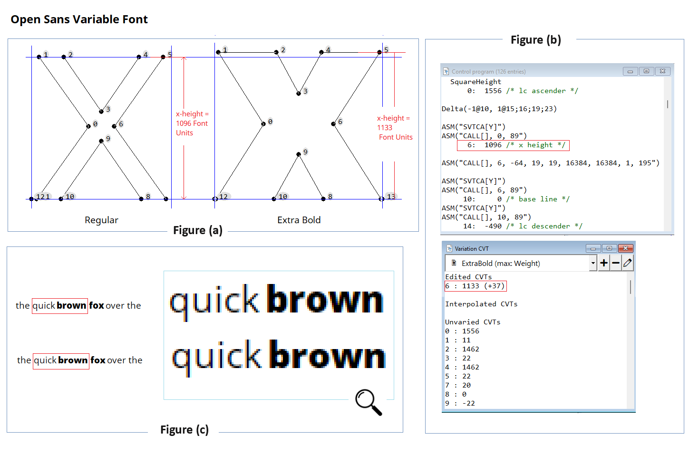
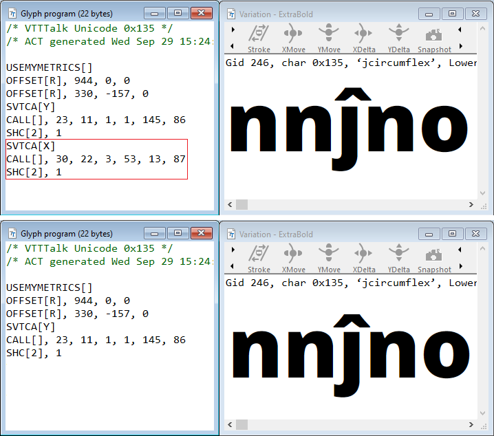
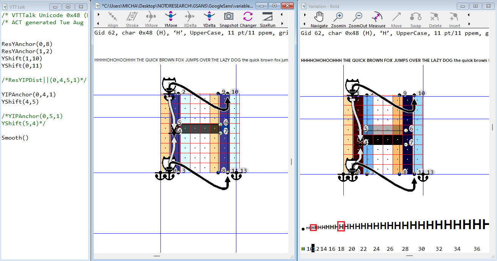
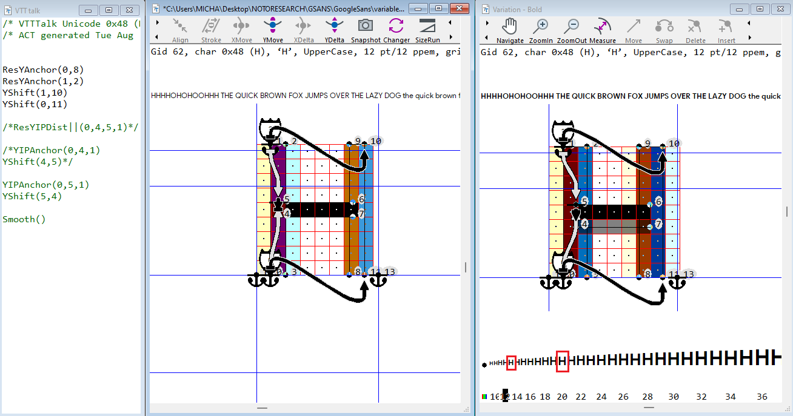
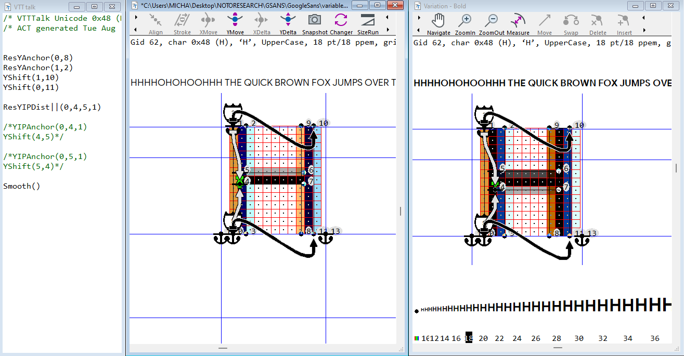

# Research, define and expand on, current deficiencies in VTT. 

by [Michael Duggan](https://twitter.com/mickduggan)

## Introduction

VisualTrueType 6.35 includes support to handle all aspects of hinting Variable fonts. There are however some areas where the code output from the autohinter does not work optimally. There is also limited support in the Autohinter for Non Latin fonts.

The following notes are intended to open up discussion among the wider type community as well as to serve as pointers for any future open source development work on the VTT Autohinter. The areas discussed below regarding hinting variable fonts, are where I spend the the most time, both refining the code and checking for consistent and reliable code output. The eventual goal is to achieve a greater level of consistency, correctness and confidence in the code output, resulting in less time spent making manual adjustments to the code. The notes are broken out into a few rough categories.

**Existing bugs or unexpected behaviours while using VTT 6.35**

**Ideas, and code for future hinting of Variable fonts**

_These ideas will require more discussion and full testing. Once they are fully developed, and tested, they can be documented and made available for use in hinting Variable fonts. These ideas cover areas of hinting variable fonts._ 

**Currently supported but needs development work and tesitng, to refine, to fit into the current hinting workflow**

_- Addition of Global deltas to cvt’s for variation instances or ranges_

_- Function to centre middle bars_

**Future ideas for VTT autohinter development work** 

**New ideas for approaches to hinting for modern rendering environments**
 
*All notes are based on the publicly available current version of Visual TrueType 6.35, running on Surface Laptop  / Windows 11

## Bugs / Suggestions

**Compile VTT talk via menu option, not working**
Changes made manually to the code in the VTT Talk window, are not compiled when using the menu option Tools > Compile > VTT talk. 

**Repo:** Open a font in VTT. Add autohinting. Make a manual edit to the VTT Talk code. Use the menu option to complie the changes via, Tools > Compile > VTT talk

**Expected:** Code should compile. The usual and faster method of using CTRL R (Compile) is working as expected

**Importing xml files into larger fonts showing spinning disk**

Importing an xml file into a larger font, shows a spinning disk. It appears that the application has hung, with no indication of progress.

**Repo:** Open a larger font in VTT. (Inter Variable font) Add autohinting. Export XML file,File > Export > All code to XML. Make a change to the xml file. Import file, File > Import > All code from XML. For the Inter Varaible font example the code can take up to 1 + minutes, and looks like the application has hung. For larger fonts such as any CJK, it is difficul to know how loong this action will take. 

**Suggestion:** Show progress bar for import of xml.

**Code is not compiled on Import of XML file**
Once the XML file is imported, the code needs to be compiled. Tools > Complile > Everything for all glyphs. 

**Suggestion:** Add option to Import, Compile everything for all glyphs and save. 

## Instance Range CVT Deltas

**Targeted cvt deltas for design space instances or instance ranges**

A common feature in typeface design, is the x-height is often designed to vary across weights. For example the x-height in the heavier weights, is often designed to be slightly larger than the Regular. When typeset in print or at high resolution, the x-heights ‘appear’ optically balanced. Set together, in running text, when heavier weights are used for emphasis, for example, the weights ‘appear’ to be optically aligned, even thought the x-height is larger in the bolder weights. Without this adjustment the bolder weights can appear to be too small when set next to the Regular.

This works well when the typeface is printed or used on a high resolution screen when there are enought pixels to ensure that this subtle difference does not look obviously incorrect, but instead looks optically correct. 

At smaller screen sizes on lower resolution devices however, this difference in x-height can be a full pixel. With an x-height of 10 pixels for example in the Regular, and 11 pixels in a Bolder weight, the appearance is jarring and looks incorrect, as there are not enough pixels to show this subtle difference.

For static fonts, each weight of the font contains its own set of hints and cvt values. In static fonts, the heavier weights use the correct and larger cvt value in the cvt table. For smaller sizes, where rounding of the x-height may differ from Roman to Bold, for example, [inheritance](https://github.com/googlefonts/how-to-hint-variable-fonts#cvt---control-value-table) can be used, to force the Bold weight to be equal to the Regular until a size where its appropriate to allow for this subtle difference to be shown, usually a higher sizes where there are more pixels available. This means that in static fonts, the weights can be synchronized for smaller screen sizes when needed.

In variable fonts however, one set of hints and one cvt is used for heights in the font. The difference in x-height (for example) where there is a difference, is reflected in the [CVAR](https://github.com/googlefonts/how-to-hint-variable-fonts#cvar--cvt-variations-table) table. The cvt for the x-height is set in the CVT table, for the default instance of the font, and edits are then made in the CVAR table for any heights that change across the design space. This is currently the limit for what can be done to control heights. The CVAR edits must be made to reflect acurately the measurements in the high resolution design. What this means in practice is that rounding of heights can vary between weights at smaller screen sizes on lower screen resolution. **Note:** There is no method currently to balance or synchronize the weights in Variable fonts, as is commonly done for static fonts using inheritence.

The functions documented here go some way towards being able to adress this problem. [link to separate folder on the repo that contains the functions as well as the exaplantions]

**Figure(a)**

Showing x-height measurement in font units of Open Sans Variable, Regular and Extrabold

**Figure(b)**

Showing x-height Control Value Table for Open Sans Variable Regular and CVAR adjustment for Extrabold

**Figure(c)**

Showing hinted screen rendering at 19ppem / 14 point at 96 dpi, combining Regular and Extrabold in text. **Top** showing the cvt rounding of the regular x-height (10 pixels) and the cvt rounding of the ExtraBold CVAR adjusted x-height (11 pixels) **Bottom** Showing x-height of the ExtraBold adjusted to be equal to the Regular, using FN 119.

**Details on Function 195:**

For the example shown above the call to the function is added (inside an ASM statement) to the cvt table directly after the cvt for the x-height, cvt 6 

6:   1096 /* x height */
ASM("CALL[], 6, 192, 12, 13, 16384, 16384, 1, 195") 

**Calls Function 195**

**FDEF[], 195**
/* Function 195 takes 7 arguments */
/* VERSION 1.0 20200128 */
 
/* This function moves a CVT if it is between a PPEM range AND an AXIS range. High and low values can be the same. */
/* DEPENDANCY: FN 190 */
/* CALL[],<CVT>,<amount>,<low PPEM>,<high PPEM>, <low norm AXIS>, <high norm AXIS>, <axis number>, 150 */
/* <CVT> CVT to be modified */
/* <amount> Amount to change CVT, in ± 64ths */
/* <low ppem> Lowest PPEM range to be modified (inclusive) */
/* <high ppem> Highest PPEM range to be modified (inclusive) */
/* <low AXIS> Lowest normalized axis value to be modified (inclusive) */
/* <high AXIS> Highest normalized axis value to be modified (inclusive) */
/* <axis number> The axis number (one based) */
/* 195 Function number */
/* NOTE: If the axis number is not present in the font, it will return an axis value of zero. If this value is within the low AXIS to high AXIS range, the change WILL be applied. */
 
The first parameter after the call is the CVT number.

The second parameter is the change, in 1/64th of a pixel. So, making the CVT two pixels smaller would be -128. A full pixel higher woudl be 64.

The third and fourth parameters are the size range to apply this change. It is inclusive, so 12, 13 would be 12 and 13 PPEM. 12,12 would be just 12 PPEM. 12,30 would be 12 through 30. In the example above 19,19, adjusts the Extrabold x-height at 19ppem only

The fifth and sixth parameters are the ranges to along a variable font axis to apply the change. The ranges must be expressed in what are called by variable fonts, “normalized coordinates”. Normalized coordinates are a mathematical scaling of the coordinate space where zero is the default outline, plus one is the maximum for the axis and minus one is the minimum for the axis. 

Glyph #379 in the Selawik Varaible font shows an example of normalized values for the weight axis. (Glyph #382 is a hexadecimal version of the same). 
 
For this function to work, it needs the equivalent of FN 190, which for a given axis number returns the current axis value. (If the equivalent function number is not 190, FN 195 — or whatever it might be renumbered to — needs to be updated to reference the different function number for FN 190).

The VTT assembler can also work with hexadecimal numbers. Glyph 382 shows the hexadecimal value for the axis. In this sample use of the function as shown above:
ASM("CALL[], 6, -64, 19, 19, 16384, 16384, 1, 195")
Instead of using 16834, you could use a hexadecimal value of 4000. The sample would look like this:
ASM("CALL[], 6, -64, 19, 19, 0x4000, 0x4000, 1, 195")
…where “0x” indicates the number is hexadecimal and it would perform exactly the same as the previous sample.
 

**Other example**
Superior letters need to to use a cvt to control the size on screen and uses one cvt for all weights. Bolder weights could be adjusted in ranges or individual instances to be larger at smaller sizes
show problem
show adjusted cvt

**Issues and suggestions:** More testing and documentation is needed. Make the Functions available for use for hinting Variable fonts. Longer term have the Autohinter output these function as part of the default Font Program output. 

## Accent positioning and hinting 

**Note: bug / suggestion**

**Autohinter output for x-axis Accent positioning is incorrect in Variable fonts**

The current version of the VTT Autohinter outputs positioning code for both x and y direction positioning of accents above base glyphs. 

**X-Positioning code**

The autohinter has an option to disable all x-direction hinting for the entire font under _(Tools > options > Autohinter Tab > Disable X-Direction Hints)_  X-positioning code for accents is still generated however when this option is set.

**Recommendation:** Disable x-positioning code output from Autohinter for accents positioning in x-direction [SVTCAX]

The code refers to a function (note number) which results in badly position accents in Variable fonts

The code used in the VTT Version 6.35 to position accents in the x-direction causes problems in Variable fonts. Currently all accented glyphs need to be carefully checked to make sure the automatic code is correct.

**Accent Positioning code**

X-direction positioning Code

**Top:** Function 87, used to position accents, causes the circumflex accent, to be uncentered.

**Bottom:** X-direction code removed. Glyph program compiled and saved. Accent is now centered and positioned correctly, using x-offset code only, for all Variation instances.

The x-direction code for composite glyphs, generated by the autohinter, should be removed for all accented glyphs. Function 87, used to position accents, can cause badly positioned accents in some Variation instances in Variable fonts.

The x-offset code is sufficient to position accents correctly for all Variation Instances in the x-direction. By removing the x-direction code, accents will be positioned correctly. 

This also reduces the overall font file size.

**Y-Positioning code**

The autohinter also generated y-axis positioning code to position accents above base glyphs.

[add discussion and text from Hinting Variable fonts, describing the problem]

**Current solution**
[Insert graphic] with y-code v custom y-code

Show example [ insert graphics and code explanations as in VTT Hinting Variable fonts]

**Recommendation:** Refine function to output corrected positioning code. 

**Recommendation:**  Future Autohinter development 

**Better default Autohinting of accents**

The autohinter does not use any special method to when adding hinting to base unique accent glyphs. The result is often glyph shapes that collapse to one pixel in height, rendering the accents at smaller screen sizes unreadable. The base set of accents in a typical font, are used in many composite glyphs, in some case as much as half the glyphs set. The work to fine tune and make readable accents is critical in achieving a well hinted fonts. 

**Suggestion** Refine the autohinter approach for hinting accents, smarter auto hinting, add new rules based on current best practices for hinting accents (ie always maintain a minimum distance of two pixels etc] 

## Middle bar centering

**Use case**

In Type design it is common practice to design the middle bar of the H and other characters such as E F, to be optically centered rather than mathematically centered. There are many glyphs in a typical Latin font, including glyphs in the Latin, Greek and Cyrillic designs that share this design characteristic.

A middle bar that is designed to be mathematically centered will appear optically too low. This optical effect is adjusted for in the high resolution design. In the case of the H bar for example, the bar is moved up slightly so that it _‘appears’_ to be centered.

One of the benefits of hinting Variable fonts is one simple set of hints can be applied to all variations in the font. This approach however has drawbacks. Once the hinting code had been added, and compiled, there are not many other options to adjust any less than ideal visual results across the variation space.

Lets have a look at the following example of the Hinting for the H in Google Sans Variable. The middle bar of the H has already been designed to be slightly higher than the mathematical centre, and this works well for high resolution output such as in print or on higher resolution screens. For lower resolutions, screens, where there are less pixels, rounding issues in different weights across the variation design space can cause the middle bar to appear too low at certain sizes and in certain weights variations. 

There are only a couple of ways to approach the hinting to center the middle bar. 

1. YIP Anchor the bottom point of the middle bar between the grid fitted points on the baseline and Cap height, and control the weight of the bar vertically from the bottom to the top of the bar.

2. YIP Anchor the top point of the middle bar between the grid fitted points on the baseline and Cap height, and control the weight of the bar vertically from the top to the bottom of the bar. [insert graphic]

Both of these approaches result in the middle bar appearing too low at certain sizes in certain weight instances, in these examples in the Bold Variation at 11,13,18 and 20ppem

When hinting static fonts, whenever rounding causes the bar to appear too low, an _inline delta command_ can be added to adjust the position of the bar at a specific size to set it to correctly appear centered. **Note:** In variable fonts it is not possible to add delta commands as there is no one command that will work for all weight variations.

**Middle Bar centering Function**

Another approach to solve this problem is to use an already existing function [Function 116 as output by an older versioon of the VTT Autohinter] This function is supported in the current Font program generated by VTT when autohinting a font, but is not output by default when using the Light Latin Autohinter.

Let’s have a look at how it works to help in centering the middle bar of the H

Using this method and function results in a middle bar that is optically and visually centered accross all weight variations and sizes. One effect of this approach is that one side of the middle bar does not always fall on a sharp pixel boundary. The result of this is slightly more blur in the rendering of the horizontal bar. However this may be better for the visual output, than having the middle bar appearing to low or too high.

The Function [insert function number] supports two methods of use

1. Uses a cvt to control the weight of the middle bar

2. uses a Dist to control the weight of the middle bar

Unfortunately neither of these methods fit into the current workflow and methods for hinting Variable fonts. Cvt’s are not typically not used to control the weights of  vertical features (ie: horizontal bars) 

The second method that uses a dist to control the weight is also not suitable for all variable fonts, especially any that support lighter weight variations. The dist command by its nature, always rounds to a full pixel. This causes too much distortion in lighter weights and is not recommend for use.

[Insert graphic example]

**Recommendation**

Refine the current function used for centering, to support ’Yshift’, to control the weight of the vertical bar feature, while keeping the centering aspect of the function. This will maintain a consistency with current recommended hinting practic, that uses the shift command to control the weight of horizontal features. Document the function and make it available for hinting Variable fonts. 

